# EventFlow AI: Enterprise Architecture Handbook

**Version:** 1.0 (Production Stabilization Phase)
**Classification:** Internal Technical Architecture Documentation

---

## SECTION 1 — EXECUTIVE OVERVIEW

### 1.1 Project Overview & Mission Statement
EventFlow AI is a distributed, AI-assisted orchestration platform designed to automate and manage the complex, highly-variable operational lifecycles of large-scale events (hackathons, conferences, enterprise summits).

Our mission is to **replace spreadsheet chaos with deterministic, reliable automation.**

### 1.2 The Operational Problem Statement
Traditional event management relies on fragmented SaaS tools stitched together by human operators using spreadsheets, Slack channels, and manual email blasts. As events scale past hundreds of participants, this "human middleware" fails. Tasks are dropped, communications are delayed, and operational visibility becomes a lagging indicator based on manual status updates.

### 1.3 Why Orchestration Matters
EventFlow AI introduces **Orchestration-First Design**. Instead of simply storing data (e.g., a list of participants), the platform executes a *Workflow Directed Acyclic Graph (DAG)* for every operational entity. The platform does not just record that an event is happening; it actively drives the event forward through automated queues, AI-assisted decision gates, and human-in-the-loop approvals.

### 1.4 Why Realtime Visibility and Distributed Execution Matter
To manage thousands of concurrent participants, evaluations, and anomalous incidents, execution must be distributed across worker queues. However, distributed execution creates an observability gap. EventFlow AI solves this by coupling a distributed Celery backend with a high-frequency WebSocket layer, providing event organizers with a deterministic, real-time, "air-traffic control" view of every executing task, failure, and anomaly across the entire operational footprint.

---

## SECTION 2 — ORIGINAL ARCHITECTURE VISION

### 2.1 The Vision
The original architectural intent was to build a highly responsive, event-driven system heavily augmented by autonomous AI agents. The philosophy was to allow AI to make real-time operational decisions, routing tasks through a massive, globally distributed queue system, while front-end clients maintained persistent WebSocket connections for live updates.

**Original Philosophies:**
- **AI-Agentic Orchestration:** AI agents would autonomously resolve issues and dynamically generate workflows on the fly without human intervention.
- **Event-Driven Microservices:** Completely decoupled services communicating purely through Kafka/RabbitMQ.
- **Limitless Queuing:** Heavy reliance on complex, multi-tiered Celery/Redis queues to handle unbounded load.

### 2.2 Why We Pivoted (The Reality of Enterprise Operations)
During implementation, we discovered that **autonomous AI agents in operational orchestration create unacceptable risk.** Event organizers do not want black-box AI making unapproved decisions (e.g., autonomously emailing 5,000 attendees). 

We pivoted to **Deterministic, AI-Assisted Orchestration**. AI is used to *draft* workflows, *detect* anomalies, and *recommend* team formations, but execution is strictly governed by a deterministic DAG engine and human-in-the-loop approvals.

### 2.3 Original Architecture Diagrams

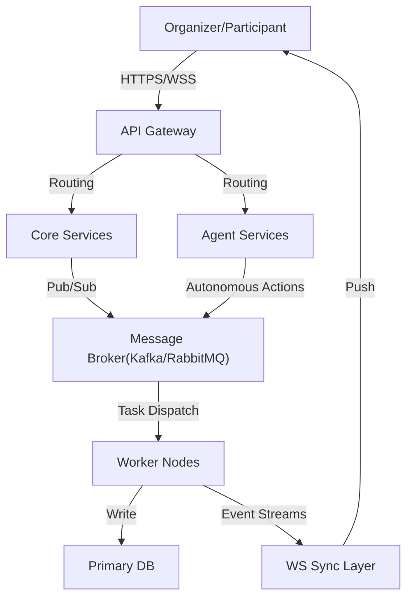

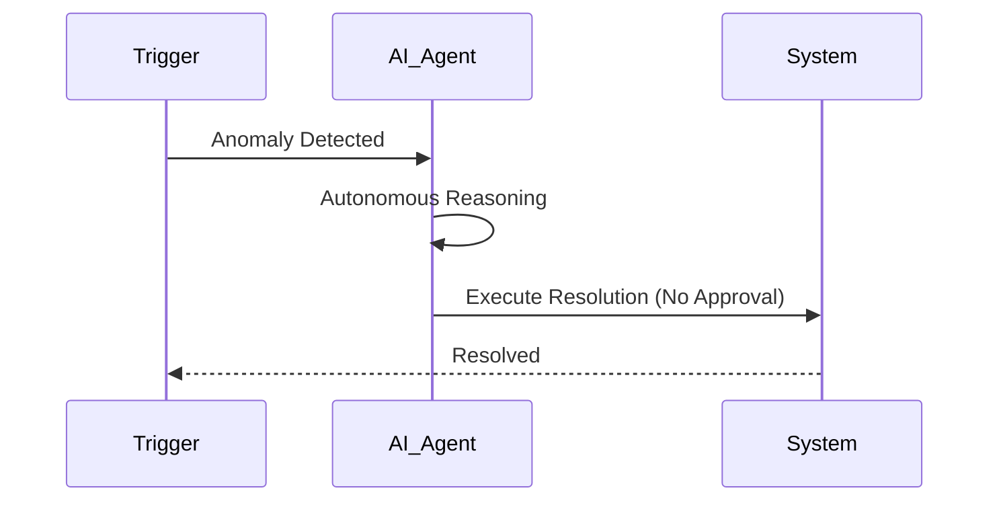

---

## SECTION 3 — FINAL IMPLEMENTED ARCHITECTURE

The final architecture represents a mature, deterministic, and highly stable distributed system. It trades autonomous chaos for observable, reliable orchestration.

### 3.1 System Components
- **Frontend (React/Vite/Zustand/React Query):** A highly polished, code-split SPA. Uses suspense boundaries, memoization, and incremental DAG patching to render massive workflow graphs at 60fps.
- **Backend (FastAPI/SQLAlchemy):** Asynchronous API layer. Strictly handles HTTP requests, RESTful validation (Pydantic), and database transactions.
- **Database (PostgreSQL 16):** The absolute source of truth. Handles complex relational models, JSONB configuration payloads, and heavy aggregations for the dashboard.
- **Orchestration Runtime (Celery + PostgreSQL):** A database-backed DAG engine. Celery workers execute the actual tasks, but the workflow state, dependencies, and lineage are transactionally stored in Postgres.
- **Realtime Layer (FastAPI WebSockets + Redis Pub/Sub):** A multi-topic broadcast system. Includes a Redis-backed replay window to instantly resynchronize clients that experience network blips.

### 3.2 Implemented Architecture Diagrams

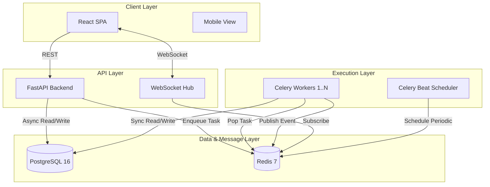

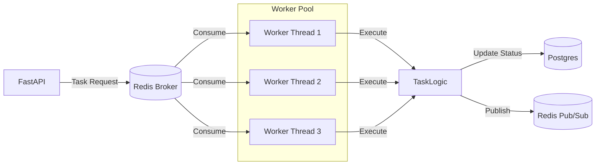

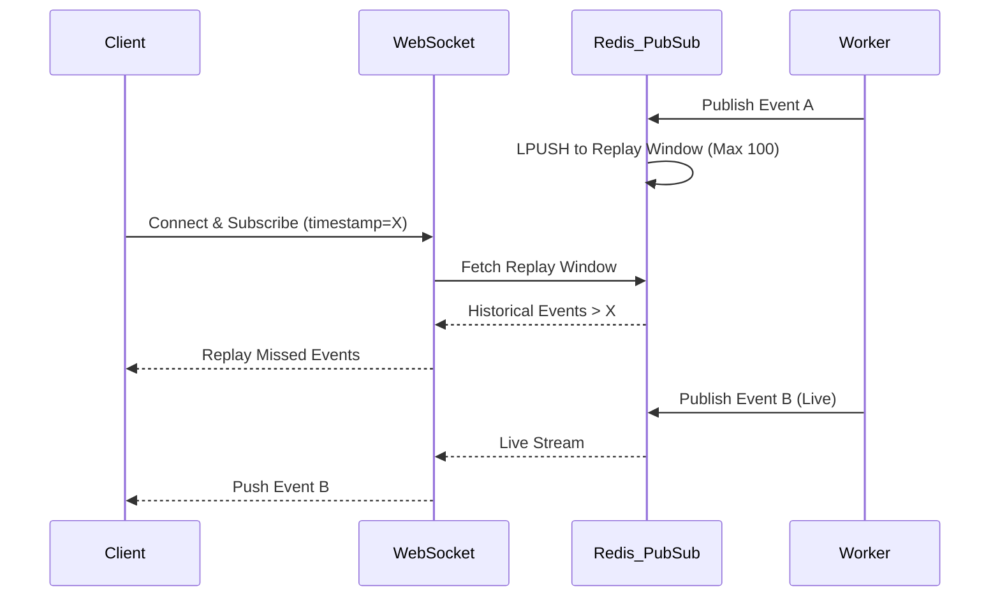

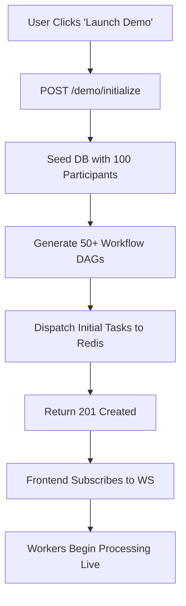

---

## SECTION 4 — COMPLETE WORKFLOW EXECUTION FLOW

EventFlow AI utilizes a strictly deterministic Directed Acyclic Graph (DAG) execution model.

### 4.1 The Lifecycle
1. **Trigger:** An event occurs (e.g., a user registers).
2. **DAG Generation:** The API compiles a workflow template into a series of `WorkflowTask` rows in Postgres, mapping dependencies via a `dependencies` JSON array.
3. **Dispatch:** Root nodes (tasks with no pending dependencies) are enqueued to Redis via Celery.
4. **Execution:** A Celery worker picks up the task, marks it `running`, and executes the logic.
5. **Resolution:** Upon success, the task is marked `completed`. The worker queries the DB for downstream tasks whose dependencies are now fully satisfied, and enqueues them.
6. **Approval Suspension:** If a task requires human intervention (e.g., "Approve Budget"), the task halts in an `awaiting_approval` state. It is removed from the active queue. When an admin clicks "Approve", the API manually dispatches the task back to the queue.
7. **Synchronization:** Every state transition (pending -> running -> completed) fires a Redis Pub/Sub message. The WebSocket hub broadcasts this to the frontend, instantly updating the DAG visualizer.

### 4.2 Execution Flow Diagrams

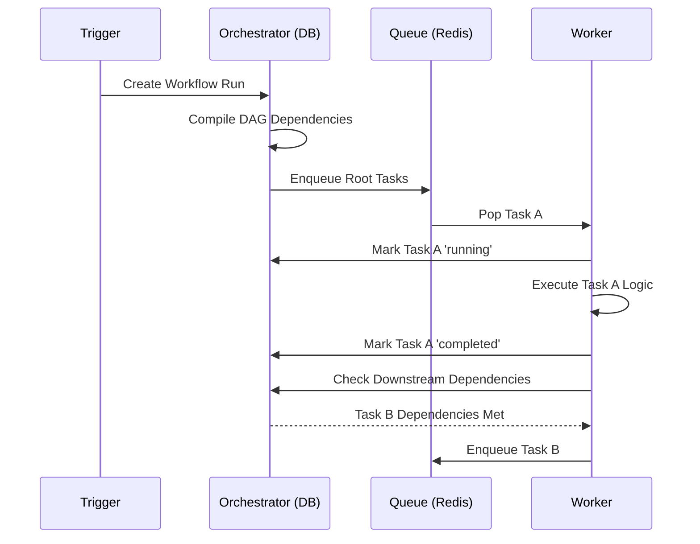

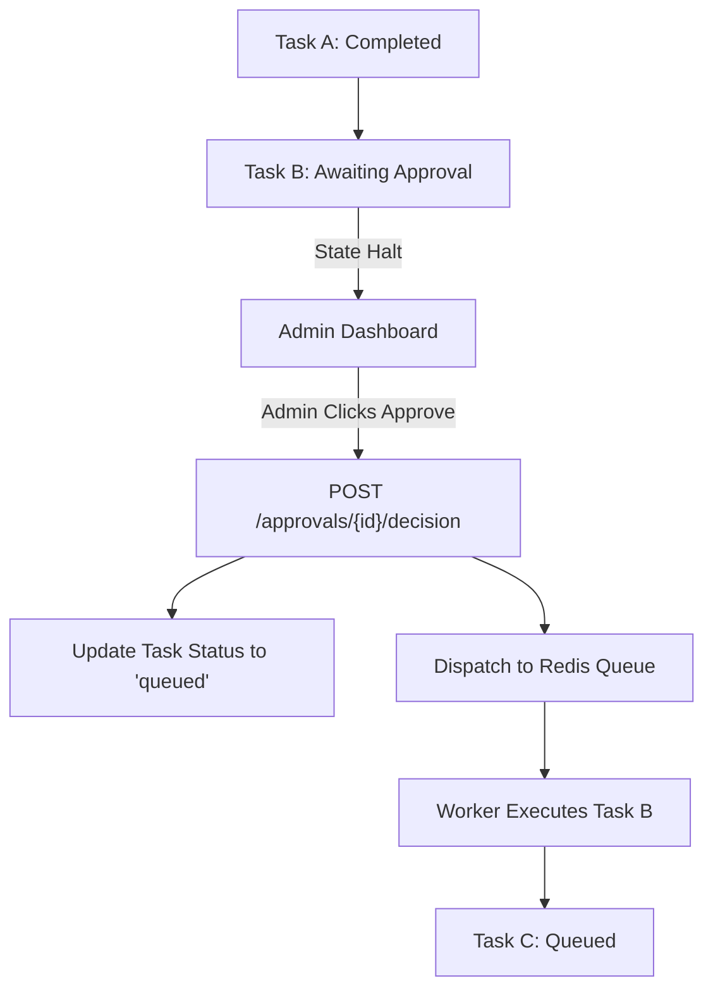

---

## SECTION 5 — AI ORCHESTRATION SYSTEM

### 5.1 Intelligence Philosophy
We utilize AI strictly as a **"Co-Pilot"**, not an autonomous agent. Large Language Models (via LangChain/LangGraph) are incredibly powerful at synthesizing information, recognizing patterns, and generating complex configurations. They are historically unreliable at executing mission-critical transactional logic.

**How we use AI:**
- **Dynamic Workflow Generation:** Instead of hard-coding hackathon workflows, the AI interprets a natural language description ("We are hosting a 3-day hardware hackathon") and generates a tailored JSON JSONB DAG template.
- **Anomaly Detection:** AI asynchronously sweeps system logs and metrics to detect logical anomalies (e.g., "Team A has 10 members, but max size is 4").
- **Communications:** AI drafts context-aware emails for human review, never sending them autonomously.

### 5.2 AI Architecture Diagrams

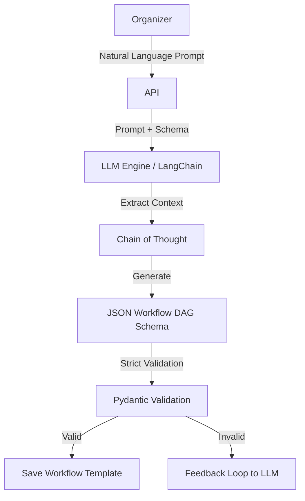

---

## SECTION 6 — REALTIME SYSTEMS

### 6.1 Architecture Overview
Realtime synchronization is critical for operational confidence. EventFlow AI uses a hybrid polling + push model. 
- **Heavy Payloads:** Standard REST/React Query.
- **State Deltas:** WebSockets push lightweight JSON patches.

### 6.2 The Replay Window
When a user opens their laptop or recovers from a dropped WiFi connection, they might have missed critical task updates. The Redis-backed Replay Window stores the last 100 broadcast events. Upon reconnection, the client sends its last known timestamp, and the server immediately replays missed events before streaming live data.

### 6.3 Realtime Diagrams

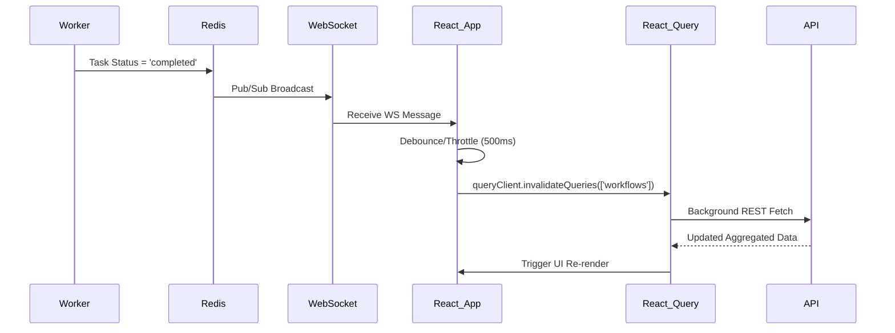

---

## SECTION 7 — RESILIENCE & FAILURE HANDLING

### 7.1 Operational Continuity
The system is built to survive partial outages. 
- **Database Connection Pooling:** SQLAlchemy singleton patterns prevent connection exhaustion during task bursts.
- **Worker Health Monitoring:** Polled asynchronously without blocking the main event loop. If workers die, tasks safely accumulate in Redis queues until workers are restored.
- **Degraded Mode:** The `GlobalOperationalStatus` component intelligently monitors data freshness. If the WebSocket disconnects or workers die, the UI gracefully enters a "Degraded Mode," alerting the user while remaining functional for static reads.

### 7.2 Failure Flow Diagrams

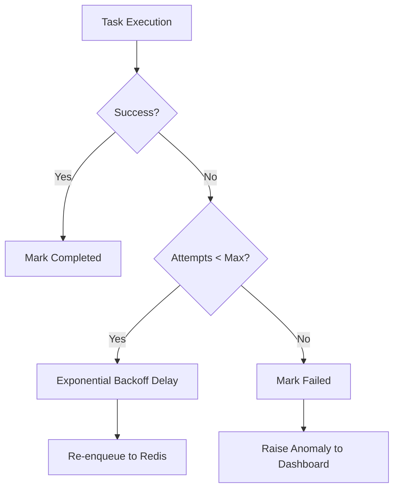

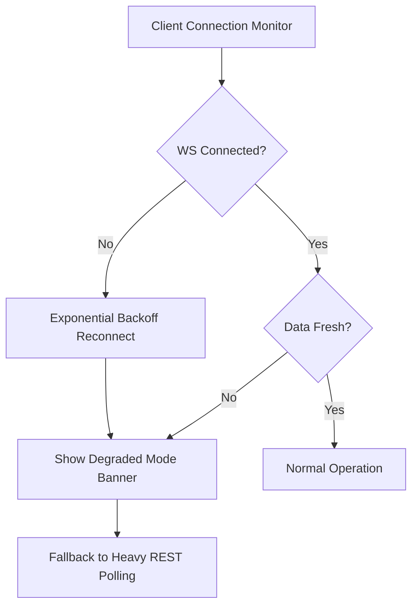

---

## SECTION 8 — PERFORMANCE OPTIMIZATION

### 8.1 The Render Bottleneck
Rendering a live DAG with hundreds of nodes that change state every millisecond will freeze standard React applications.
**Solutions:**
- **Incremental Patching:** The `WorkflowDAGViewer` runs the heavy layout engine (Dagre) exactly once. Subsequent WebSocket updates only apply CSS class patches to specific nodes via memoized components, bypassing full re-layouts.
- **Debounced Invalidation:** A storm of 50 WebSocket messages in 1 second does not trigger 50 API calls. It triggers a single debounced invalidation to fetch the newly aggregated state.
- **Sequential DB Queries:** We abandoned `asyncio.gather` for heavy queries to prevent SQLAlchemy connection collisions, relying instead on incredibly fast, indexed sequential queries.

### 8.2 Optimization Diagrams

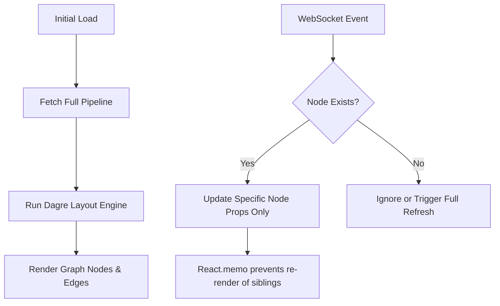

---

## SECTION 9 — DEMO MODE ARCHITECTURE

### 9.1 Deterministic Simulation
For executive showcases and hackathon judging, waiting days for a workflow to naturally execute is impossible.
The `/demo/initialize` endpoint acts as a "Time Machine."
1. It seeds the database with 100 synthetic users.
2. It generates massive, complex workflow DAGs.
3. It enqueues the root nodes into the live Celery queues.
4. The system actually processes the workload live, providing a stunning visual cascade of execution across the UI.

---

## SECTION 10 — FINAL SYSTEM CAPABILITIES

| Capability | Status | Description |
| :--- | :---: | :--- |
| **Workflow Orchestration** | ✅ | Fully operational, DB-backed DAG engine. |
| **Realtime Synchronization** | ✅ | Resilient WS layer with replay window. |
| **Distributed Execution** | ✅ | Multi-queue Celery integration. |
| **AI Assistance** | ✅ | LangGraph generation and anomaly detection. |
| **Approval Systems** | ✅ | Human-in-the-loop task suspension and resume. |
| **Resilience & Recovery** | ✅ | Exponential backoff, retries, and degraded modes. |
| **Operational Dashboards** | ✅ | Aggregated, live-updating metrics and telemetry. |
| **Autoscaling Infrastructure** | ⚠️ | Requires external Kubernetes/KEDA integration. |

---

## SECTION 11 — ENTERPRISE SCALE LIMITATIONS

While the application layer is highly optimized, the underlying infrastructure currently restricts true enterprise scale (e.g., >50,000 concurrent participants).

**Current Limitations to Address Before IPO-Scale:**
1. **Compute Orchestration:** We currently rely on manual `docker-compose` worker provisioning. This MUST move to **Kubernetes** with **KEDA** (Kubernetes Event-driven Autoscaling) to dynamically scale worker pods based on Redis queue depth.
2. **Database Offloading:** The primary Postgres database handles both heavy transactional writes (workflow states) and heavy analytical reads (dashboard aggregations). We need **Read Replicas** and PgBouncer.
3. **Observability Stack:** Audit logs are currently stored in Postgres. This will rapidly degrade performance. Logs must be migrated to a dedicated Elasticsearch or ClickHouse cluster. Distributed tracing (Datadog/OpenTelemetry) is required to trace tasks across the Redis boundary.
4. **Redis Bottleneck:** A single Redis node manages both Celery brokering and WebSocket Pub/Sub. Under extreme load, this will throttle. These concerns must be partitioned into separate Redis clusters.

---

## SECTION 12 — FINAL ENGINEERING EVOLUTION STORY

**The Journey from Prototype to Platform:**

EventFlow AI began as an ambitious prototype, heavily leaning into the hype of autonomous AI agents. Our early iterations featured agents making independent decisions, communicating via message buses, and updating UIs on the fly. It looked impressive, but under the hood, it was terrifying. State was unpredictable, error handling was a black box, and race conditions ran rampant.

The turning point occurred when we recognized that **enterprise operations demand predictability over autonomy.** We aggressively stripped out the autonomous execution layer, replacing it with a rock-solid, database-backed Celery DAG engine. We relegated AI to an advisory and drafting role—a brilliant "Co-Pilot" that never pulls the trigger without a human's permission.

The final stabilization phase was an exercise in extreme rigor. We hunted down every silent failure, every stale React closure, and every blocking synchronous call that threatened the event loop. We implemented replay windows for dropped connections, debounced rendering to achieve 60fps graphs, and completely isolated our database sessions to prevent concurrency crashes.

The result is no longer a collection of "random distributed systems stitched together." It is a cohesive, mature, production-grade orchestration platform. It is stable, it is incredibly fast, and it is ready to manage reality.
